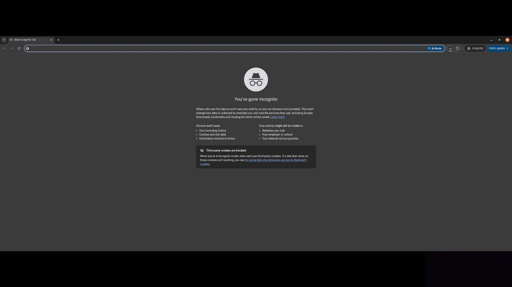
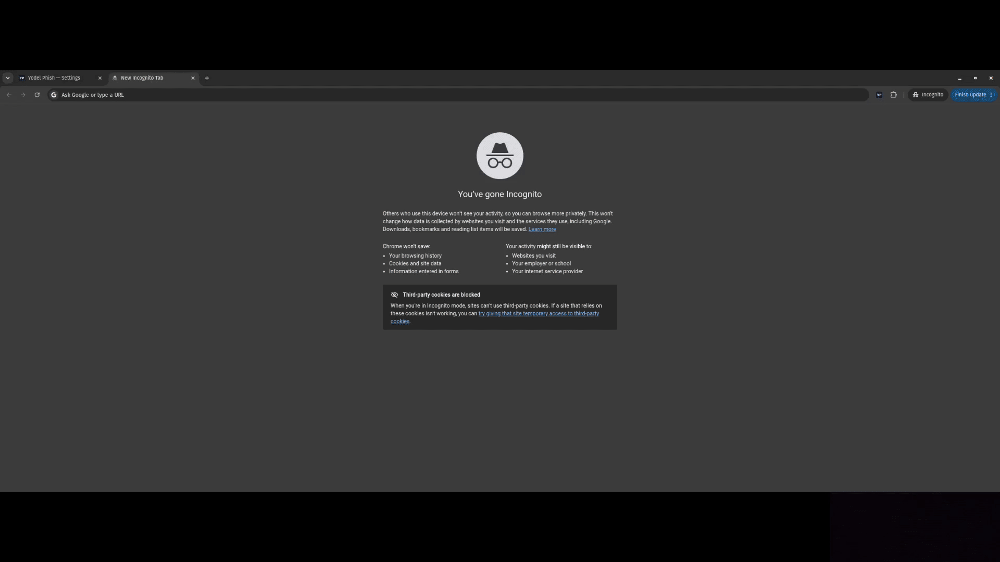
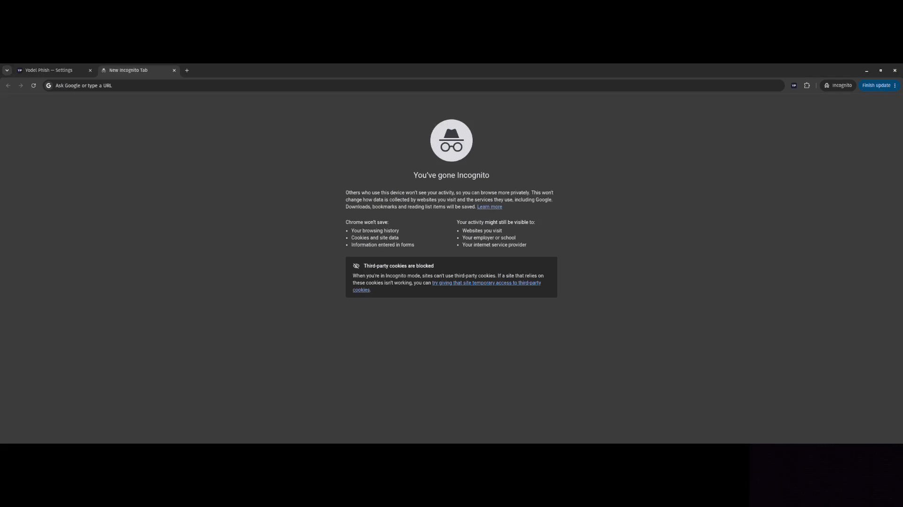
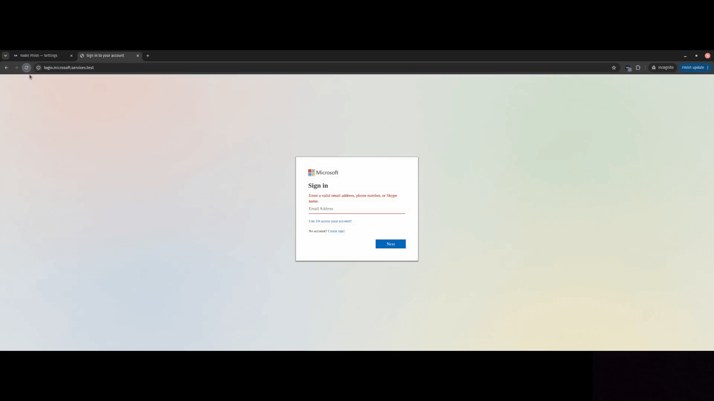
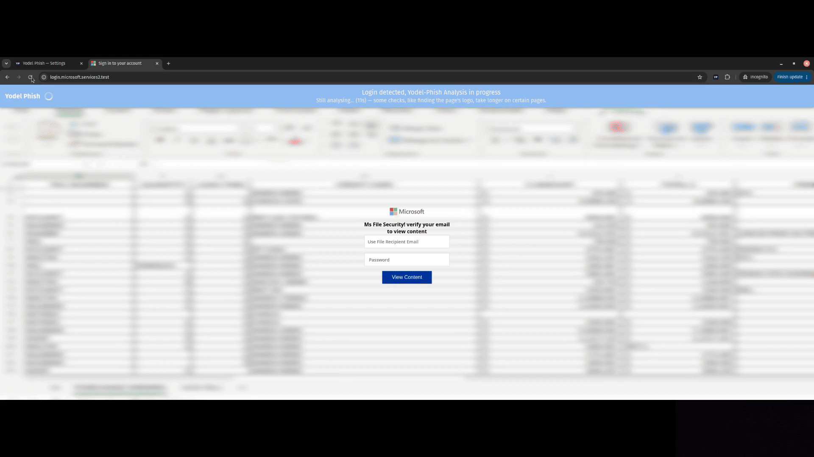
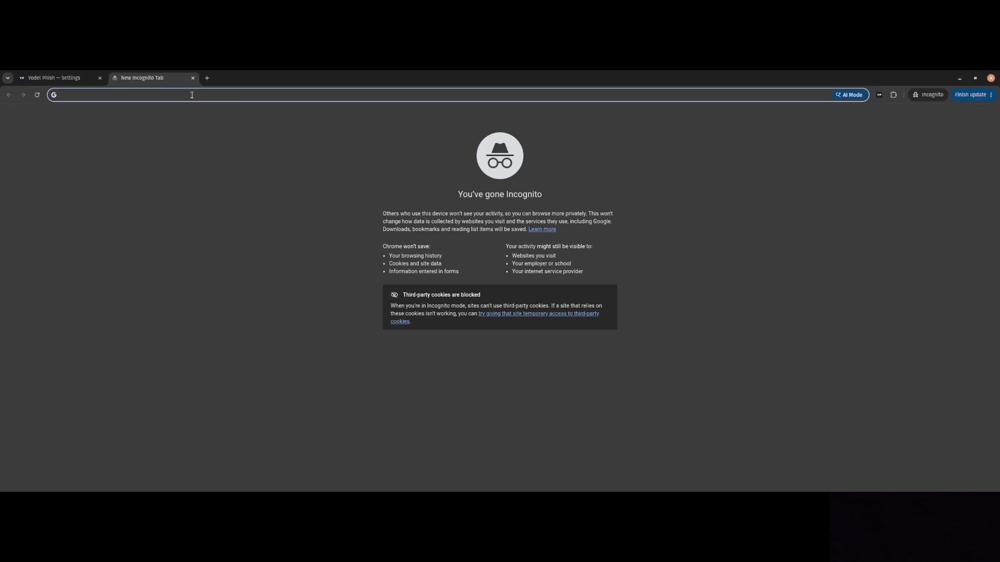
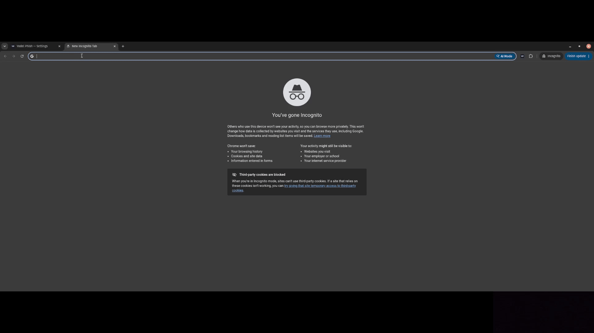
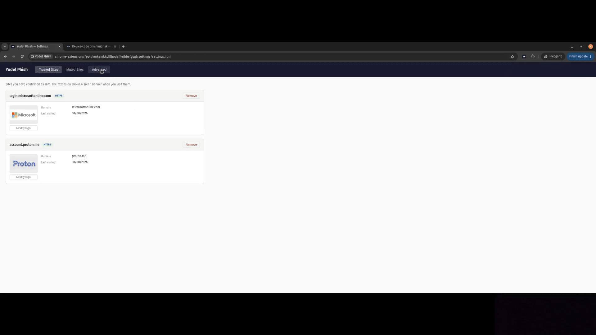
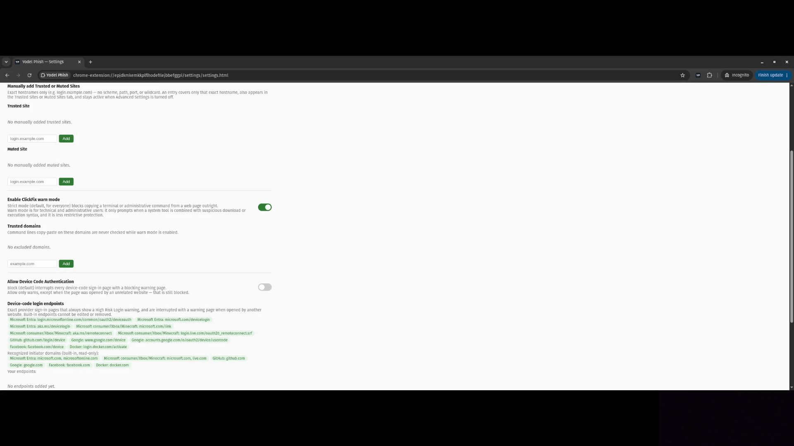

<p align="center">
  
</p>

<h1 align="center">Yodel Phish</h1>

<p align="center">
  <strong>Local, privacy-first phishing protection for Chromium browsers.</strong>
</p>

<p align="center">
  A Chromium extension that detects lookalike login pages, blocks ClickFix clipboard attacks, and protects against suspicious OAuth device-code sign-ins—without sending your browsing data or screenshots to a server.
</p>

<p align="center">
  <a href="https://github.com/w0-0p/yodel-phish">Source code</a>
  ·
  <a href="https://github.com/w0-0p/yodel-phish/issues">Report an issue</a>
  ·
  <a href="https://github.com/w0-0p/yodel-phish/blob/main/PRIVACY.md">Privacy</a>
</p>

> **Public beta:** Yodel Phish version 0.1.0 is still being tested.

## Yodel Phish protects from

### Phishing

The extension detects phishing pages that imitate trusted login sites on the wrong domain. If a page looks like a saved trusted service but is hosted somewhere suspicious, the extension blocks the page and warns you before you enter your credentials.

### ClickFix

The extension detects when a website tries to copy a PowerShell, Terminal, Command Prompt, Run dialog, or other system command to your clipboard. It blocks the command by default and shows you exactly what was blocked, including hidden control characters.  
Yodel Phish detects automatic clipboard copying, Ctrl+C, and right-click copying.  
Two modes are available: strict (for non-technical users) and warning (for power users)

### Device-code sign-ins

The extension detects potentially malicious OAuth device-code sign-in attempts. If an unrelated website sends you to a protected device-code page, the extension interrupts the navigation and warns you.  
Two modes are available: strict (for non-technical users) and warning (for power users)

## How to use the extension

Yodel Phish performs its analysis inside the browser. When it finds a page that contains a login form, it captures the visible viewport and looks for evidence that the page is imitating one of your trusted references.

1. **Define trusted references.** After installation, visit the login pages of services you use, such as email or online banking. Yodel Phish detects the login form and lets you add the site to your trusted list and select the service's logo. It stores the hostname, logo, and relevant brand terms locally.
2. **Detect login pages.** While browsing, when a page contains sign-in controls, Yodel Phish compares it with your trusted references. If it visually resembles a trusted site but uses a different domain, the extension raises a warning.
3. **Compare multiple signals.** OYodel Phish checks brand text with OCR, compares logos with computer vision, and uses DINOv2 embeddings for additional visual similarity. These signals are analysed and combined into a detection score.
4. **Show the result.** Trusted sites receive a confirmation banner. Suspicious pages trigger a warning. High-confidence impersonation attempts are blocked with no option to continue.

*Menu Walkthrough*


*Add to trusted*


*Select Logo*


*Phishing Alert, similar*


*Phishing Alert, different*


*ClickFix Attack*


*Device Code Phish*


*ClickFix Warn Mode*


*Device Code Warn Mode*



## Features overview

| Feature | What it does |
| --- | --- |
| **Local page analysis** | Uses OCR, OpenCV, YOLO, and DINOv2 in the extension to assess login-page impersonation. |
| **Trusted-site references** | Lets you save recognised legitimate sites, with logo and brand evidence used for future comparisons. |
| **Hard phishing warnings** | Interrupts high-confidence login impersonation with an explicit warning page instead of a bypass action. |
| **ClickFix protection** | Blocks dangerous clipboard writes from webpages in the default strict mode. |
| **Device-code protection** | Warns about or blocks risky OAuth device-code navigation, depending on its origin and policy. |
| **Trusted and muted sites** | Lets you manage exact hostnames that are trusted or muted; ClickFix and device-code protection remain active on muted sites. |
| **Manual analysis** | Provides a one-click analysis action from the extension popup. |
| **Accessible warnings** | Uses clear severity labels, visible controls, and configurable banner text size. |
| **Advanced diagnostics** | Optional, local analysis history can be reviewed, exported as JSON, or cleared. |

## Private by design

Yodel Phish is built so protection does not require handing over your browsing data.

- Page screenshots, OCR, visual analysis, and model inference run locally in the browser.
- The installed extension has no telemetry, advertising, analytics, or runtime screenshot-upload endpoint.
- Full screenshots are not retained in persistent storage.
- It does not continuously read your clipboard. Clipboard writes are mediated only when its ClickFix policy is applied.
- Diagnostic history is optional, disabled unless Advanced Settings are enabled, limited to the most recent 25 analyses, and can be exported or cleared by you.

Some local data is necessarily retained to make protection useful: settings, trusted or muted hostnames, trusted-reference data, and temporary warning state. See the full [Privacy Policy](PRIVACY.md) for what is processed, retained, and deleted.

## Your controls

Yodel Phish gives you control over how it behaves:

- Save, remove, or edit trusted-site references.
- Mute ordinary login-page detection for an exact hostname when needed. This does not turn off ClickFix or device-code protection.
- Choose a small, medium, or large warning-banner text size.
- Run an analysis manually from the extension popup.
- In Advanced Settings, manage technical policy controls, custom device-code endpoints, optional ClickFix warn mode, and local diagnostic history.

Advanced controls can reduce the default protection level. They are intended for technically informed users.

## Install and try it

Yodel Phish currently targets Chrome and compatible Chromium browsers, version 116 or later.

For a local build from source:

```sh
git clone https://github.com/w0-0p/yodel-phish.git
cd yodel-phish/Extension
npm ci
npm run models:download
npm run build
```
## Built openly

Yodel Phish is open source under the [GNU Affero General Public License v3.0 only](LICENSE). The project uses established local-analysis components including Tesseract.js, OpenCV, ONNX Runtime, YOLO, and DINOv2. Model provenance and third-party notices are documented in the repository.

If you find a bug, false positive, or false negative, please [open an issue](https://github.com/w0-0p/yodel-phish/issues). For security-sensitive reports, follow the project's [security policy](SECURITY.md).

## Disclaimer

**Human contributions:** original idea; dataset curation and annotation; detection-pipeline architecture, implementation, testing, tuning, and evaluation; model fine-tuning; UI design and integration; review, testing and validation of all outputs.  
**Coding assistants:** Claude Fable and Opus and OpenAI Codex 5.6 were used for code drafting, refactoring, debugging, documentation, and implementation support. All generated output was reviewed, thoroughly tested, and approved by the human contributor(s).
